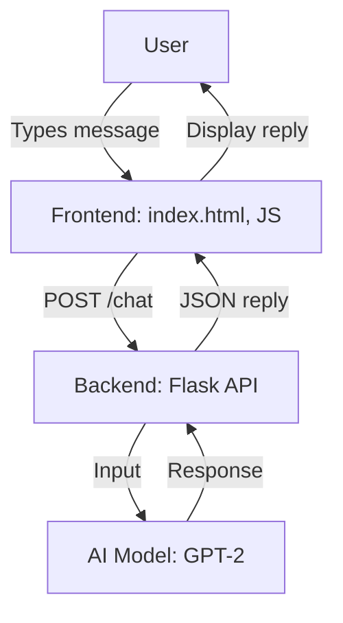

```mermaid
graph TD
    A[User] -->|Types message| B[Frontend: index.html, JS]
    B -->|POST /chat| C[Backend: Flask API]
    C -->|Input| D[AI Model: GPT-2]
    D -->|Response| C
    C -->|JSON reply| B
    B -->|Display reply| A
```